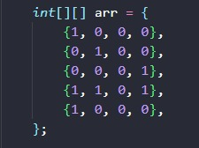
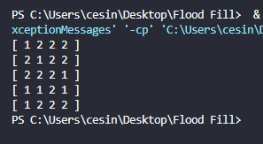

# Trabalho de Resolução de Problemas Estruturados em Computação

Esse repositório contém uma implementação de Flood Fill na linguagem Java, desenvolvido no segundo semestre de 2023.

Alunos Envolvidos:

<ul>
    <li>César Willian Pacheco</li>
    <li>Otávio Carneiro</li>
    <li>Rodrigo Munch</li>
</ul>

<h2>Flood-Fill</h2>

O trabalho tem como objetivo implementar o algoritmo Flood-Fill, aceitando uma matriz de inteiros inicial e retornando essa mesma matriz após a execução do algoritmo".

Input Matriz Inicial -> Começando a execução na coordenada -> Linha 0, Coluna 1

0 = Vazio, 1 = Bloqueado, 2 = Pintado

 

Resultado Final da Execução

 

 

